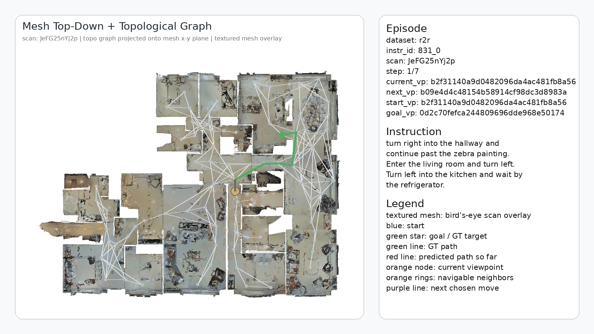
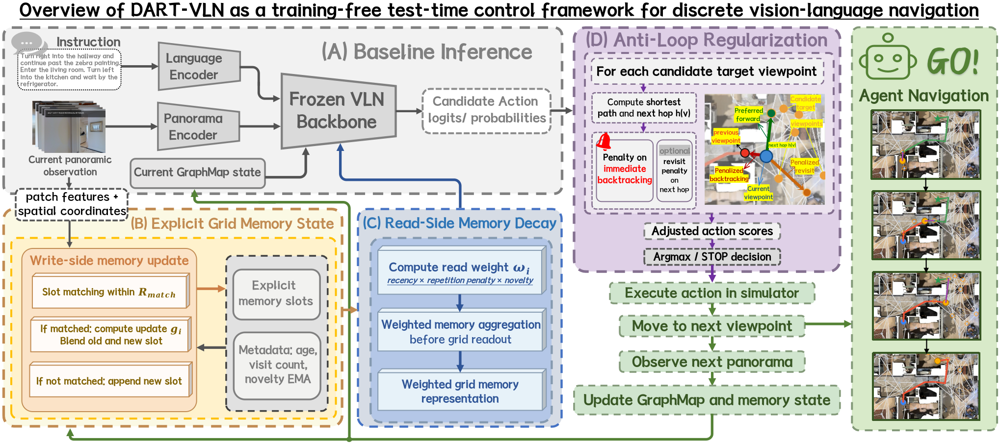
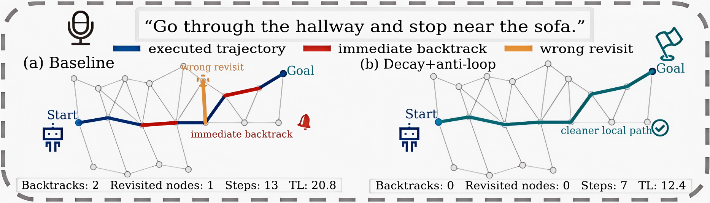

# DART-VLN: Test-Time Memory Decay and Anti-Loop Regularization for Discrete Vision-Language Navigation

[](https://www.ieeesmc2026.org/)
[](https://github.com/Japluto/DART-VLN)

**Shaoheng Zhang<sup>1</sup>**, **Zhichen Li<sup>2</sup>**, and **Jie Mei<sup>1,*</sup>**

<sup>1</sup> School of Intelligence Science and Engineering, Harbin Institute of Technology, Shenzhen<br>
<sup>2</sup> School of Computer Science and Technology, Harbin Institute of Technology, Shenzhen<br>
<sup>*</sup> Corresponding author

> **Accepted by the 2026 IEEE International Conference on Systems, Man, and Cybernetics (IEEE SMC 2026).**

This repository contains the official implementation of **DART-VLN**, a training-free test-time control framework for memory-based discrete vision-language navigation (VLN). DART-VLN is instantiated on a frozen [GridMM](https://github.com/MrZihan/GridMM) navigator and improves inference behavior without retraining, architectural changes, or additional learnable parameters.

## Overview

Memory-based VLN agents can suffer from two recurring inference-time failures: stale historical evidence during memory readout and inefficient local backtracking during action selection. DART-VLN addresses them with two complementary modules:

- **Test-Time Memory Decay** reweights stale and redundant grid-memory slots during readout while leaving their stored content unchanged.
- **Anti-Loop Regularization** applies a lightweight next-hop penalty before argmax action selection to discourage immediate reversals and repeated revisits.

The default DART-VLN configuration combines read-side decay with anti-loop regularization. More aggressive write-side memory updates are retained as ablations (`update_only` and `full`) rather than used by default.



## Highlights

- **Training-free:** uses the original GridMM checkpoints with no additional optimization.
- **Plug-in inference control:** the navigation backbone and stored memory representations remain unchanged.
- **Efficient navigation:** reduces stale-memory interference, local backtracking, trajectory length, and runtime.
- **Clean ablations:** supports `off`, `decay_only`, `update_only`, and `full` memory modes, with anti-loop control enabled independently.
- **R2R and REVERIE:** evaluated on both instruction-following navigation and remote object grounding.
- **Trajectory visualization:** includes textured bird's-eye and first-person rendering utilities for Matterport3D scenes.

## Method

<p align="center">
  
</p>

<p align="center"><em>Figure 1. DART-VLN is a plug-in test-time control layer for discrete VLN pipelines with explicit memory. Memory decay reweights historical slots at readout, while anti-loop regularization adjusts next-hop scores before argmax. The backbone remains frozen and no learnable parameters are added.</em></p>

### Test-Time Memory Decay

For each explicit memory slot, DART-VLN maintains three lightweight metadata values: **age**, **visit count**, and **novelty**. Novelty measures recent feature change and is smoothed with an exponential moving average. During memory readout, the three signals are combined so that stale and repeatedly observed slots receive less weight, while slots with recent feature changes retain more influence.

The default decay module is deliberately read-side only: it reweights slot contributions during aggregation but never overwrites the stored memory content. Lower and upper weight bounds prevent overly weak or aggressive suppression. This conservative design makes the module training-free and keeps the frozen navigation backbone unchanged.

### Anti-Loop Regularization

For every candidate target viewpoint, DART-VLN computes the **graph next hop**—the local transition that would actually be executed from the current viewpoint. It then applies two lightweight score penalties:

- a backtrack penalty when the next hop returns directly to the previous viewpoint;
- a smaller revisit penalty after the next-hop viewpoint has already been visited at least twice.

The adjusted scores are used only before deterministic argmax action selection. The penalties are finite and no action is masked, so the agent can still backtrack when the original policy provides sufficiently strong evidence. Anti-loop regularization does not alter the stop head, add a planner, or modify the learned backbone.

### Conservative Test-Time Control

The default DART-VLN configuration combines **read-side memory decay** with **anti-loop regularization**. The write-side `update_only` and `full` variants are included as stress tests because rewriting frozen-policy memory is less stable. This separation keeps the default intervention compact, interpretable, and easy to apply to an existing GridMM checkpoint.

## Main Results

All variants below use the same GridMM checkpoints and differ only in test-time control. Runtime is reported for GridMM variants under the same implementation on an NVIDIA GeForce RTX 5070 Ti; it should not be compared directly with runtime reported by other papers.

### R2R

| Method | Val Unseen TL ↓ | NE ↓ | SR ↑ | SPL ↑ | Runtime (s) ↓ | Test Unseen TL ↓ | NE ↓ | SR ↑ | SPL ↑ | Runtime (s) ↓ |
|---|---:|---:|---:|---:|---:|---:|---:|---:|---:|---:|
| GridMM | 13.27 | 2.83 | 74 | 64 | 937.99 | 14.43 | 3.35 | 73 | 62 | 2312.52 |
| decay-only | 13.29 | **2.59** | **76** | 65 | 742.61 | 14.52 | **3.19** | 73 | 62 | 1621.34 |
| **DART-VLN (decay + anti-loop)** | **12.41** | 2.69 | **76** | **66** | **666.37** | **13.80** | 3.38 | **74** | **63** | **1329.56** |

### REVERIE Val Unseen

| Method | TL ↓ | OSR ↑ | SR ↑ | SPL ↑ | RGS ↑ | RGSPL ↑ | Runtime (s) ↓ |
|---|---:|---:|---:|---:|---:|---:|---:|
| GridMM | 23.20 | 57.48 | 51.37 | 36.47 | 34.57 | 24.56 | 4329.67 |
| decay-only | 23.15 | **58.12** | 51.98 | 36.60 | 34.68 | 24.72 | 2998.49 |
| **DART-VLN (decay + anti-loop)** | **21.57** | 57.99 | **52.34** | **37.53** | **35.37** | **25.44** | **1497.98** |

Anti-loop regularization also reduces immediate backtracking from 3.51% to 2.01% on R2R Val Unseen and from 8.45% to 5.99% on REVERIE Val Unseen relative to decay-only.

### Navigation Behavior

<p align="center">
  
</p>

<p align="center"><em>Figure 2. Decay plus anti-loop avoids immediate backtracking and follows a shorter path than the baseline.</em></p>

## Installation

### 1. Matterport3D Simulator

Install [Matterport3DSimulator](https://github.com/peteanderson80/Matterport3DSimulator) and expose its Python bindings:

```bash
export PYTHONPATH=/path/to/Matterport3DSimulator/build:$PYTHONPATH
```

### 2. Python Environment

```bash
conda create -n dart-vln python=3.8
conda activate dart-vln
pip install -r requirements.txt
```

The repository also includes `setup_gridmm_modern_env.sh` for the maintained local environment setup.

### 3. Data, Features, and Checkpoints

Large datasets, precomputed features, and model weights are not committed to Git. The main local targets are:

```text
datasets/
├── R2R/
│   ├── annotations/
│   ├── connectivity/
│   ├── features/
│   └── exprs_map/
├── REVERIE/
│   ├── annotations/
│   ├── features/
│   └── exprs_map/
├── Matterport3D/
└── trained_models/
```

The exact required files are checked by:

- `map_nav_src/scripts/run_r2r.sh`
- `map_nav_src/scripts/run_reverie.sh`

Official data references:

- [Matterport3DSimulator and R2R](https://github.com/peteanderson80/Matterport3DSimulator)
- [REVERIE](https://github.com/YuankaiQi/REVERIE)
- [Matterport3D download script](http://kaldir.vc.cit.tum.de/matterport/download_mp.py)

## Evaluation

The public code exposes DART-VLN through environment variables in the R2R and REVERIE launch scripts.

### Baseline GridMM

```bash
cd map_nav_src
bash scripts/run_r2r.sh test
```

### Decay-Only

```bash
cd map_nav_src
DYNAMIC_MEMORY_MODE=decay_only \
ANTI_LOOP_MODE=off \
bash scripts/run_r2r.sh test
```

### DART-VLN on R2R

```bash
cd map_nav_src
DYNAMIC_MEMORY_MODE=decay_only \
DYNAMIC_MEMORY_EXTRA_ARGS="--dynamic_memory_decay_lambda 0.12 --dynamic_memory_repeat_weight 0.15 --dynamic_memory_min_mem_weight 0.35 --dynamic_memory_max_mem_weight 1.0" \
ANTI_LOOP_MODE=on \
ANTI_LOOP_EXTRA_ARGS="--anti_loop_backtrack_penalty 0.22 --anti_loop_revisit_penalty 0.06 --anti_loop_revisit_thresh 2 --anti_loop_min_step 1" \
bash scripts/run_r2r.sh test
```

### DART-VLN on REVERIE

```bash
cd map_nav_src
DYNAMIC_MEMORY_MODE=decay_only \
DYNAMIC_MEMORY_EXTRA_ARGS="--dynamic_memory_decay_lambda 0.12 --dynamic_memory_repeat_weight 0.15 --dynamic_memory_min_mem_weight 0.35 --dynamic_memory_max_mem_weight 1.0" \
ANTI_LOOP_MODE=on \
ANTI_LOOP_EXTRA_ARGS="--anti_loop_backtrack_penalty 0.22 --anti_loop_revisit_penalty 0.06 --anti_loop_revisit_thresh 2 --anti_loop_min_step 1" \
bash scripts/run_reverie.sh test
```

The paper configuration uses `decay_lambda=0.12`, `repeat_weight=0.15`, `min_mem_weight=0.35`, `max_mem_weight=1.0`, `backtrack_penalty=0.22`, `revisit_penalty=0.06`, and `revisit_threshold=2`. Available memory modes are:

```text
DYNAMIC_MEMORY_MODE=off|update_only|decay_only|full
ANTI_LOOP_MODE=off|on
```

`update_only` and `full` are write-side stress-test variants. The recommended setting is `decay_only + anti-loop`.

To train or fine-tune the retained GridMM backbone rather than apply the training-free DART-VLN controller, replace `test` with `train` in the corresponding launch command.

## Repository Structure

```text
DART-VLN/
├── map_nav_src/                  # discrete navigation, DART-VLN, and evaluation
│   ├── r2r/                      # R2R task logic
│   ├── reverie/                  # REVERIE task logic
│   ├── models/                   # navigation models
│   ├── scripts/                  # experiment and visualization entrypoints
│   └── utils/                    # shared utilities
├── preprocess/                   # feature preprocessing
├── pretrain_src/                 # retained GridMM pretraining code
├── example_831_0/                # curated qualitative example
├── run_r2r_mesh_vis.sh           # R2R visualization entrypoint
├── run_reverie_mesh_vis.sh       # REVERIE visualization entrypoint
└── trajectory.gif                # project preview
```

## Visualization

The repository includes a Matterport3D mesh-based bird's-eye renderer that overlays the topological graph, ground-truth path, predicted path, current viewpoint, and next step. It exports frame sequences, GIFs, and MP4 videos.

```bash
./run_r2r_mesh_vis.sh
./run_reverie_mesh_vis.sh
```

Optional arguments set the number of episodes and output FPS:

```bash
./run_r2r_mesh_vis.sh 5 3
./run_reverie_mesh_vis.sh 5 3
```

Outputs are written under `visualizations/mesh_bev_textured/`. A lightweight public example for `scan=JeFG25nYj2p` and `instr_id=831_0` is provided in [`example_831_0`](example_831_0/README.md).

## Citation

If you find this project useful, please cite:

```bibtex
@inproceedings{zhang2026dartvln,
  title     = {{DART-VLN}: Test-Time Memory Decay and Anti-Loop Regularization for Discrete Vision-Language Navigation},
  author    = {Zhang, Shaoheng and Li, Zhichen and Mei, Jie},
  booktitle = {2026 IEEE International Conference on Systems, Man, and Cybernetics (SMC)},
  year      = {2026},
  note      = {Accepted}
}
```

## Acknowledgments

This project is built on [GridMM](https://github.com/MrZihan/GridMM), [VLN-DUET](https://github.com/cshizhe/VLN-DUET), and [Matterport3DSimulator](https://github.com/peteanderson80/Matterport3DSimulator). We thank the authors for releasing their code and resources.
